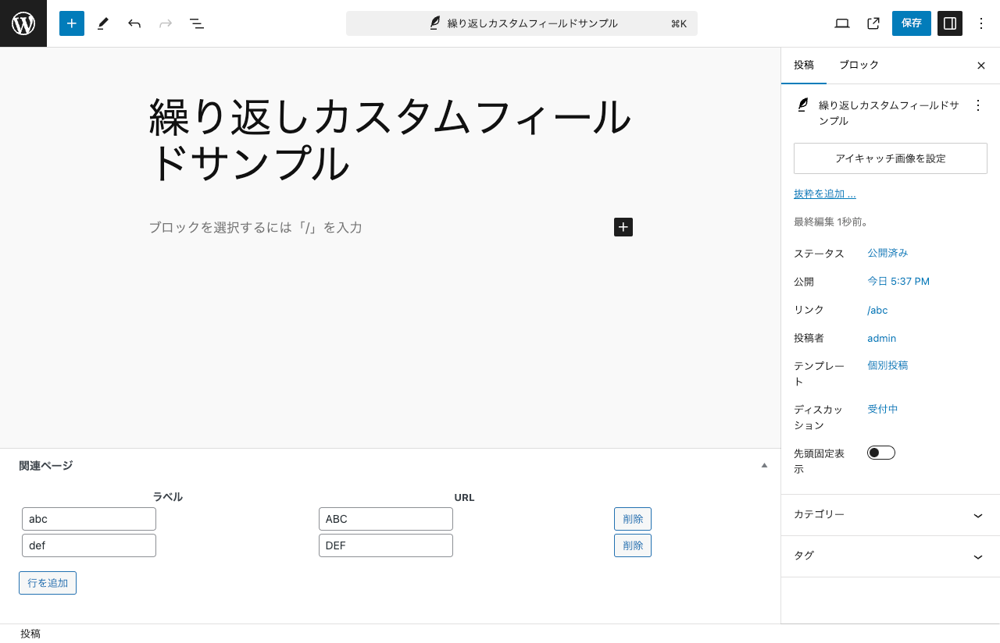

# WordPress プラグイン `custom-field-related-pages`

WordPress において無償・有償のプラグインを使わずに繰り返し可能なカスタムフィールドを独自に実装するサンプルです。

## 使い方

リポジトリのファイルをダウンロードして WordPress の `wp-content/plugins` ディレクトリに展開してください。

プラグインを有効化したら「投稿」で使えます。

